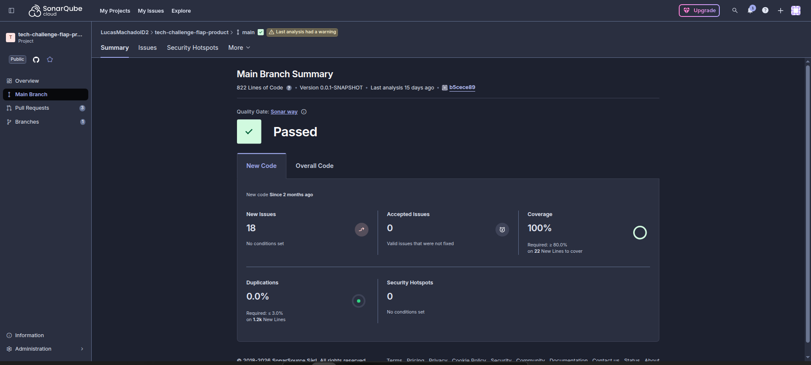

# Product Microservice - Tech Challenge FIAP

Este é um microserviço dedicado ao gerenciamento de produtos, desenvolvido em Java com Spring Boot e MongoDB, seguindo os princípios da Clean Architecture.

## 🚀 Funcionalidades

- ✅ Salvar produto
- ✅ Encontrar produto pelo ID
- ✅ Deletar produto pelo ID
- ✅ Listar todos os produtos
- ✅ Encontrar produtos por categoria
- ✅ Encontrar produtos em promoção
- ✅ Encontrar produtos pelo nome
- ✅ Buscar produtos por categoria e faixa de preço
- ✅ Buscar produtos por categoria e faixa de preço (implementação manual)

##  Cobertura de testes



## 🏗️ Arquitetura

O projeto segue os princípios da **Clean Architecture**:

```
├── domain/
│   ├── entities/        # Entidades de negócio
│   ├── repositories/    # Interfaces dos repositórios
│   └── usecases/        # Casos de uso (regras de negócio)
├── application/
│   ├── dto/             # Data Transfer Objects
│   └── services/        # Serviços de aplicação
└── infrastructure/
    ├── config/          # Configurações Spring
    ├── persistence/     # Implementação MongoDB
    └── web/             # Controllers REST
```

## 🛠️ Tecnologias

- **Java 17**
- **Spring Boot 3.2.0**
- **Spring Data MongoDB**
- **MongoDB**
- **Maven**
- **Swagger/OpenAPI 3**
- **ModelMapper**

## 📋 Pré-requisitos

- Java 17+
- Maven 3.6+
- MongoDB (pode usar Docker)

## 🚀 Como executar

### 1. Clone o repositório
```bash
git clone <repository-url>
cd tech-challenge-fiap-product
```

### 2. Inicie o MongoDB com Docker
```bash
docker-compose up -d mongodb
```

### 3. Execute a aplicação
```bash
mvn spring-boot:run
```

A aplicação estará disponível em: `http://localhost:8080`

## 📚 Documentação da API

Acesse a documentação Swagger em: `http://localhost:8080/swagger-ui.html`

## 🔗 Endpoints Principais

### Produtos
- `POST /api/products` - Criar produto
- `GET /api/products` - Listar todos os produtos
- `GET /api/products/{id}` - Buscar produto por ID
- `DELETE /api/products/{id}` - Deletar produto
- `GET /api/products/category/{category}` - Buscar por categoria
- `GET /api/products/promotions` - Produtos em promoção
- `GET /api/products/search?name={name}` - Buscar por nome
- `GET /api/products/category/{category}/price-range?minPrice={min}&maxPrice={max}` - Buscar por categoria e preço
- `GET /api/products/category/{category}/price-range-manual?minPrice={min}&maxPrice={max}` - Buscar por categoria e preço (manual)

## 📊 Monitoramento

- Health Check: `http://localhost:8080/actuator/health`
- Metrics: `http://localhost:8080/actuator/metrics`

## 🧪 Exemplo de Payload

### Criar Produto
```json
{
    "name": "Hambúrguer Artesanal",
    "description": "Hambúrguer com pão artesanal, carne 180g, queijo e salada",
    "price": 25.90,
    "category": "Lanches",
    "onPromotion": false,
    "promotionPrice": null
}
```

### Resposta
```json
{
    "id": "507f1f77bcf86cd799439011",
    "name": "Hambúrguer Artesanal",
    "description": "Hambúrguer com pão artesanal, carne 180g, queijo e salada",
    "price": 25.90,
    "category": "Lanches",
    "onPromotion": false,
    "promotionPrice": null,
    "effectivePrice": 25.90,
    "createdAt": "2024-01-15 10:30:00",
    "updatedAt": "2024-01-15 10:30:00"
}
```

## 🔧 Configuração

As configurações podem ser alteradas no arquivo `application.yml`:

```yaml
spring:
  data:
    mongodb:
      uri: mongodb://localhost:27017/product_db
```

## 🏃‍♂️ Executando Testes

```bash
mvn test
```

## 📁 Estrutura do Projeto

```
src/
├── main/
│   ├── java/com/fiap/techchallenge/productmicroservice/
│   │   ├── domain/
│   │   ├── application/
│   │   ├── infrastructure/
│   │   └── ProductMicroserviceApplication.java
│   └── resources/
│       └── application.yml
└── test/
    └── java/
```